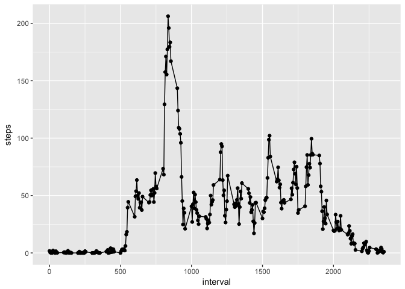

opts_chunk$set(fig.path = "figure/") 

## Loading and preprocessing the data

First we will require any libraries we will need *(if you do not have required packages you will need to install them)*

```r
require(dplyr)
require(ggplot2)
```

then we will unzip the data (if we have not already) and load the data in

```r
if(!file.exists("activity.csv")){
  unzip("activity.zip")
}

activityData <- read.csv("activity.csv")
```

we will need to convert the dates from factor to datetime and offer a version of the data that doesn't have NA values

```r
activityData <- activityData %>%
  mutate(date = as.POSIXct(as.character(date), format="%Y-%m-%d"))

activityDataFiltered <- activityData %>%
  filter(!is.na(steps))
```


## What is mean total number of steps taken per day?

For this part of the assignment, you can ignore the missing values in
the dataset.

Next a histogram of the total number of steps taken each day (using ggplot2)

```r
qplot(activityDataFiltered$steps, geom = "histogram", bins = 100) 
```

<!-- -->


The **mean** and **median** total number of steps taken per day are calculated as follows

```r
mean(activityDataFiltered$steps)
```

```
## [1] 37.3826
```

```r
median(activityDataFiltered$steps)
```

```
## [1] 0
```


## What is the average daily activity pattern?

average the steps across all the days

```r
activityDataAverageDay <- activityDataFiltered %>%
  group_by(interval) %>%
  summarise(steps = mean(steps))
```

A time series plot of the average number of steps taken (y-axis) over each 5-minute interval (x-axis) 

```r
ggplot(data = activityDataAverageDay, aes(x = interval, y = steps)) +
  geom_line() +
  geom_point()
```

<!-- -->

Sorting the intervals by average steps to calculate which 5-minute interval contains the highest average

```r
arrange(activityDataAverageDay, desc(steps))$interval[1]
```

```
## [1] 835
```


## Imputing missing values

Note that there are a number of days/intervals where there are missing
values (coded as `NA`). The presence of missing days may introduce
bias into some calculations or summaries of the data.

Calculating the total number of missing values in the dataset (i.e. the total number of rows with `NA`s)

```r
activityDataMissing <- activityData %>%
  filter(is.na(steps))

nrow(activityDataMissing)
```

```
## [1] 2304
```

2. Devise a strategy for filling in all of the missing values in the dataset. The strategy does not need to be sophisticated. For example, you could use the mean/median for that day, or the mean for that 5-minute interval, etc.

By using the average number of steps for interval in the place of any missing values, we have a way to fill in the missing values with an approximation.

Here we fill in the missing values with the average for that interval

```r
activityDataRepaired <- activityData %>%
  inner_join(rename(activityDataAverageDay, stepAverage = steps), by = "interval") %>%
  mutate(steps = ifelse(is.na(steps), stepAverage, steps)) %>%
  select(steps, date, interval)
```

A histogram with the steps using the repaired data

```r
qplot(activityDataRepaired$steps, geom = "histogram", bins = 100) 
```

<!-- -->

**mean** and **median** total number of steps taken per day with the repaired data

```r
mean(activityDataRepaired$steps)
```

```
## [1] 37.3826
```

```r
median(activityDataRepaired$steps)
```

```
## [1] 0
```

While we can see a slight deviation in the overal shape of the histogram (for example we can see a slight blip around the 30 mark), it does not measureably impact either our mean or our median.


## Are there differences in activity patterns between weekdays and weekends?

Next we add a new factor variable with two levels -- "weekday" and "weekend" indicating whether a given date is a weekday or weekend day.

```r
weekdayDays <- c("Monday", "Tuesday", "Wednesday", "Thursday", "Friday")

activityDataRepaired <- activityDataRepaired %>%
  mutate(weekday = as.factor(weekdays(date))) %>%
  mutate(weekdayType = ifelse(weekday %in% weekdayDays, "weekday", "weekend")) %>%
  mutate(weekdayType = as.factor(weekdayType)) %>%
  select(steps, date, interval, weekdayType)
```


Finally, we make a panel plot containing a time series plot of the 5-minute interval (x-axis) and the average number of steps taken, averaged across all weekday days or weekend days (y-axis).

```r
activityDataAverageDayByWeekdayType <- activityDataRepaired %>%
  group_by(interval, weekdayType) %>%
  summarise(steps = mean(steps))

ggplot(data = activityDataAverageDayByWeekdayType, aes(x = interval, y = steps)) +
  facet_wrap(~weekdayType, ncol = 1) + 
  geom_line() +
  geom_point()
```

<!-- -->
